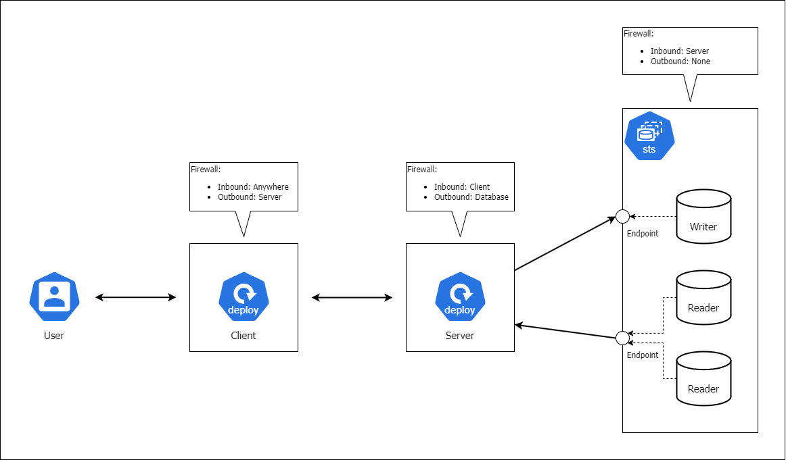

# LAB 1

Images:

- Client: j7lh/client:note-angular-0
  - ENV: API_URL
- Server: j7lh/server:note-express-mysql-0
  - ENV: DB_HOST, DB_USER, DB_PASSWORD, DB_NAME, DB_PORT
- Database: mysql:5.7
  - ENV: MYSQL_DATABASE, MYSQL_TCP_PORT, MYSQL_ROOT_PASSWORD, MYSQL_USER, MYSQL_PASSWORD

---

## Day 1: Pod Management and Services

- **Goal**: Understand Pods and how to expose them via Services.
- **Practices**:
  - **Create Client and Server Pods** using YAML manifests and `kubectl`.
  - **Expose Server Pods** using ClusterIP, NodePort, and LoadBalancer Services.
  - Use **labels and selectors** to differentiate Client and Server Pods.
  - Manually **scale Pods** to verify communication between Client and Server using Services.
  - **Verify load balancing** and traffic distribution across Server Pods.

---

## Day 2: Ingress, Egress, and Networking

- **Goal**: Configure ingress, egress, and secure communication across the architecture.
- **Practices**:
  - **Install an Ingress Controller** (NGINX or Traefik) to manage inbound traffic for the Client.
  - Create **Ingress resources** to route traffic to the Client Pods.
  - Set **Egress policies** from the Server to control outbound traffic towards the database.
  - Define **Network Policies** to isolate Client, Server, and Database Pods according to the firewall rules in your diagram.
  - **Test traffic flows** between Client and Server Pods, and between Server and the Database.

---

## Day 3: Labels, Selectors, and Namespaces Management

- **Goal**: Organize and manage resources using labels and namespaces.
- **Practices**:
  - **Create Labels and Selectors** to identify the Client and Server Pods.
  - Create **Namespaces** for separating environments (e.g., client-app, server-app, database).
  - Apply **Network Policies** to control inter-namespace communication.
  - Deploy the architecture into different namespaces and validate **cross-namespace access**.
  - **Move resources** between namespaces and test communication integrity.

---

## Day 4: Deployments, Scaling, and Health Checks

- **Goal**: Manage the scaling and health of Client and Server Deployments.
- **Practices**:
  - Create a **Deployment for the Server** with multiple replicas and verify scaling.
  - Perform **rolling updates and rollbacks** on both Client and Server Deployments.
  - Set up and verify **Readiness, Liveness, and Startup probes** for Client and Server Pods.
  - Implement **horizontal scaling** for both Client and Server Deployments based on demand.
  - **Optimize resource requests** for both Deployments to manage CPU and memory consumption.

---

## Day 5: Stateful Applications and DaemonSets

- **Goal**: Deploy stateful services, including the database, and services that run on all nodes.
- **Practices**:
  - Deploy the **database** using a **StatefulSet** (e.g., MySQL with master-slave setup for write-read operations).
  - Set up **Persistent Volume Claims (PVCs)** for the StatefulSet to store persistent data.
  - Deploy a **DaemonSet** for logging or monitoring agents across all nodes in the cluster.
  - Verify the distribution of **DaemonSet Pods** across nodes and test their functionality.
  - Compare the **behavior of StatefulSets and Deployments** to understand the differences for the database.

---

## Day 6: Persistent Storage and Configuration Management

- **Goal**: Manage persistent storage and sensitive data for the database and application configuration.
- **Practices**:
  - Create **Persistent Volumes (PVs)** and **PVCs** for both the Client and Server components.
  - **Mount PVCs** into Pods and verify persistent storage across restarts.
  - Create and manage **ConfigMaps** for non-sensitive configuration (e.g., environment variables).
  - Manage **Secrets** for sensitive data (e.g., database passwords) and use them in Pods.
  - Test **ConfigMap and Secret usage** by injecting them into Client and Server Pods as volumes or environment variables.

---

## Day 7: Security, Resource Optimization, and Monitoring

- **Goal**: Secure the application, optimize resource usage, and monitor the system.
- **Practices**:
  - Configure **Role-Based Access Control (RBAC)** for controlling access to the Client, Server, and Database Pods.
  - Define **Roles, RoleBindings, and ServiceAccounts** to manage permissions across namespaces.
  - Set **resource requests and limits** for both Client and Server Pods to optimize resource usage.
  - Install **Prometheus and Grafana** to monitor Pod and Service metrics.
  - Implement **Fluentd or ELK stack** for centralized logging, particularly for Server and Database Pods.
